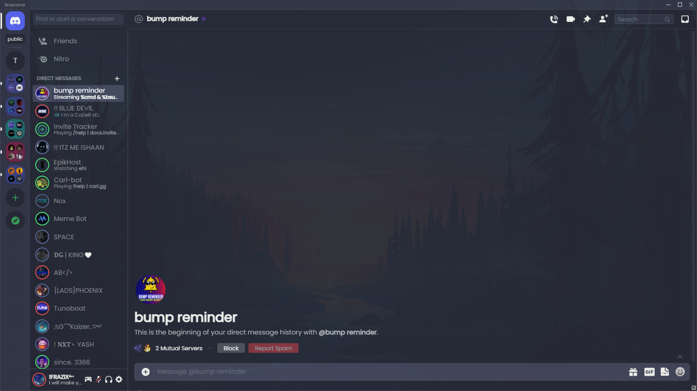
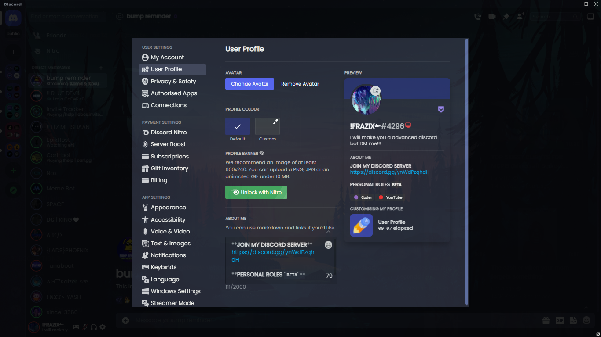

## SimpleUI

### Examples





### A Beautiful and Simple theme for betterdiscord.

---

## How to install on betterdiscord
* Download from [github releases](https://github.com/Frazix12/SimpleUi/releases)
* Select the `simpleui.theme.css` file and move to betterdiscord themes folder
* On Windows:
```
C:\Users\USERNAME\AppData\Roaming\BetterDiscord\themes
```
* On Linux:
```
/home/.config/BetterDiscord/themes
```
* On macOS:
```
/Users/(YourUser)/Library/Preferences/BetterDiscord/themes
```

---

* If you don't have git you can download the zip from [github releases](https://github.com/Frazix12/SimpleUi/releases) and manually extract and put in the themes folder


Made by [Frazix](https://github.com/Frazix12)